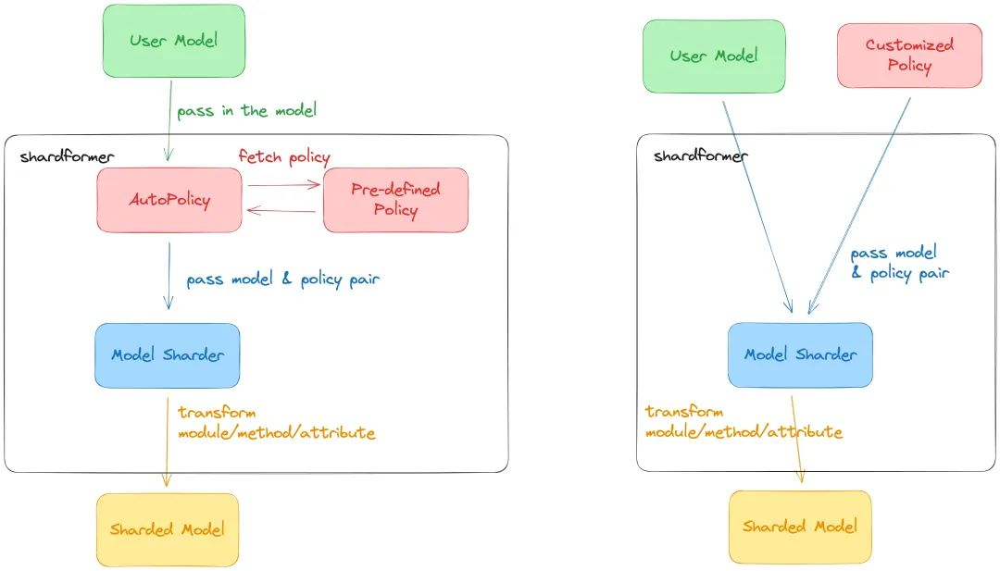

# 文章列表
## 日期：20230723
-   [第一批AIGC独角兽开始裁员了](https://mp.weixin.qq.com/s/AbexOCFmLEXr_qPIpMSTnQ)    
1.  Jasper失败的原因，包括进入一个拥挤的市场，产品竞争力不足等。还有人借此形容当下AIGC应用初创公司的困境：**GPT套壳们正在崩溃...**    
2.  没有形成技术护城河，产品容易复制    

-  [LLaMA2 RLHF 技术细节](https://zhuanlan.zhihu.com/p/644680366?utm_campaign=shareopn&utm_medium=social&utm_oi=28495224766464&utm_psn=1666393346481377280&utm_source=wechat_session&s_r=0)    
之前没有做RLHF的背景知识，可以滞后一点再看这篇文章    

## 日期：20230725
-   [一个开源方案，极速预训练650亿参数LLaMA](https://mp.weixin.qq.com/s/NG-SNAGLvNeYx33tVkkWQA)    
1.  Colossal-AI 作为全球最大、最活跃的大模型开发工具与社区。    
2.  通过 Colossal-AI 的 Booster Plugins，用户可以便捷自定义并行训练，如选择 Low Level ZeRO，Gemini，DDP 等并行策略。Gradient checkpointing 通过在反向传播时重新计算模型的 activation 来减少内存使用。通过引入 Flash attention 机制加速计算并节省显存。
3. Colossal-AI 最新的 ShardFormer 极大降低了使用多维并行训练 LLM 的上手成本。    
